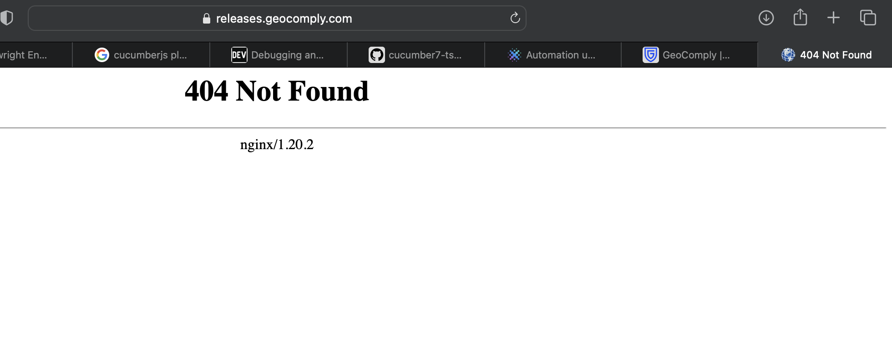

# case-study-geocomply
automation for case study, upload file for geo comply

## installation

### prequistie
- install Node js v19
- install VS code
- open terminal and run command: npm install

## Bugs
- file is not uploaded, the page is calling a delay to fake the upload progress
- allow user uploads without accept terms
- no whitelisted acceptable upload file
- executable file is allowed
- no size limit validation

## geo comply website bugs
- when user lost a password, click on get new password. page not found
.

- when scroll down, the menu is not disappearing on top.
.